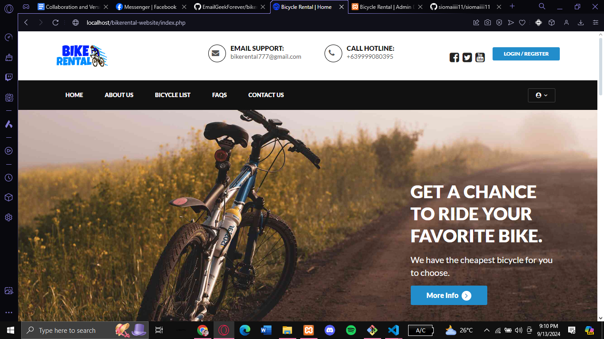
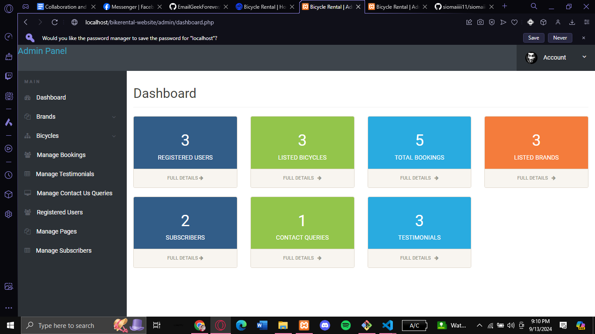
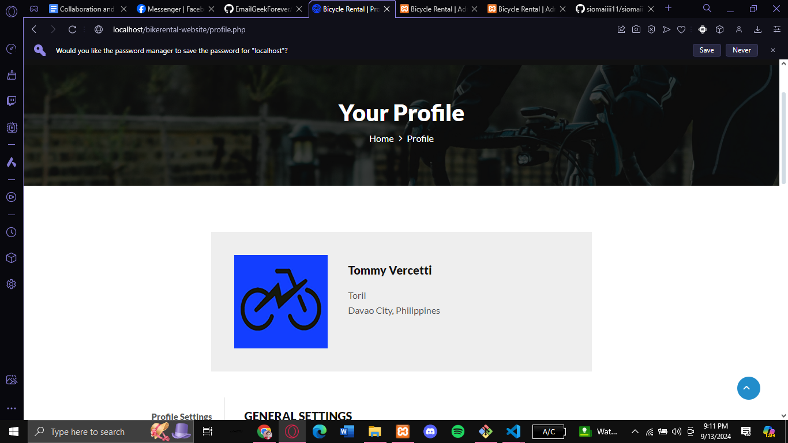

# SD-3101 [Bike Rental System]



## Table of Contents
- [Introduction](#introduction)
- [Project Overview](#project-overview)
- [Objectives](#objectives)
- [Features](#features)
- [Technologies Used](#technologies-used)
- [Setup and Installation](#setup-and-installation)
- [Usage Instructions](#usage-instructions)
- [Project Structure](#project-structure)
- [Contributors](#contributors)
- [Chagelog](#changelog)
- [Acknowledgments](#acknowledgments)
- [License](#license)

---

## Introduction
- The Bike Rental Website is a web-based platform designed to streamline the process of renting bicycles. It allows users to browse available bikes, check prices, and make reservations online. This system aims to simplify the bike rental experience for both customers and bike rental companies, providing an easy-to-navigate interface and efficient rental management tools.

## Project Overview
- The project focuses on creating a user-friendly interface for customers to rent bikes and for rental shops to manage their fleet. It integrates real-time availability checks, pricing information, and booking confirmations. The platform can be expanded to include multiple rental locations, different bike categories, and additional services like bike accessories or tours.

## Objectives
- To develop a responsive, easy-to-use bike rental platform.
- To allow users to browse available bikes and make online reservations.
- To provide rental companies with an efficient system to manage bike availability, bookings, and pricing.
- To integrate features that enhance the user experience, such as bike search filters, location mapping, and reservation tracking.

## Features
List the main features of the project:
- Bike Search: Users can search for bikes by type, location, and availability.
- Booking System: Allows users to select a rental period, view the price, and make online bookings.
- Admin Panel: Enables rental companies to manage bike listings, availability, and rental records.
- Responsive Design: The platform is optimized for both desktop and mobile devices.
- Payment Integration (Optional): Potential for future payment gateway integration to handle online payments.

## Technologies Used
Mention the tools, frameworks, and technologies used in the project:
- Frontend: HTML, CSS, JavaScript (with frameworks like Bootstrap for responsive design)
- Backend: PHP, Node.js (or other back-end technologies)
- Database: MySQL or other relational databases
- Version Control: Git for code management
- Other Tools: APIs (e.g., Google Maps for location services)

## Setup and Installation
Step-by-step instructions for setting up the project locally.

1. **Clone the repository:**

   git clone git https://github.com/EmailGeekForever/bikerental-website.git
   
2. **Set up the environment:**
	- Download and install XAMPP
  - Open the XAMPP and start Apache and MySQL services

3. **Database Setup**:
   - Import the provided database SQL file into phpMyAdmin.
   - Name the databasename bikerental
   - Open the config.php file and update the database name:
  ```php
   &db = "bikerental"
   ```
   - Clear any password in config.php by setting the password empty string
   ```php
   &db = ""
   ```
   
4. **Run the project:**
   - Move the project file in htdocs folder in XAMPP directory
   - Access the site by typing http://localhost/bikerental-website/


## Usage Instructions
Provide detailed instructions on how to use the project after setup:
- Admin Login:
  - Email: admiin
  - Password: 1234
- User Login:
  - Email: test@gmail.com
  - Password: 1234

- Screen Shot for admin side:


- Another Screenshot


## Project Structure
Explain the structure of the project directory. Example:
```bash
.
├── BIKERENTAL-WEBSITE
│   ├── admin
│   ├── assets
│   ├── include
│   └── sqlfile
├── about-us.php
├── bicycle-list.php
├── check_availability.php
├── contact-us.php
├── faqs.php
├── image-1.png
├── image-2.png
├── image.png
├── index.php
├── LICENSE
├── login account.txt
├── logout.php
├── my-booking.php
├── my-testimonials.php
├── profile
├── README.md
├── update-password.php
└── vehical-details.php
```

## Contributors

List all the team members involved in the project. Include their roles and responsibilities:

- **Rencie Rabajante**: Lead Developer, Backend Developer
- **Melvin Manual**: Frontend Developer, UI/UX Designer
- **Gerald Villaran**: Project Manager, Tester

## Project Timeline

Outline the project timeline, including milestones or deliverables. Example:

- **Week 1-2**: Research and project planning.
- **Week 3-5**: Design and setup.
- **Week 6-10**: Implementation.
- **Week 11-12**: Testing and debugging.
- **Week 13-14**: Final presentation and documentation.

## Changelog

### [Version 1.0.0] - 2024-09-07
- Initial release of the project.
- Added basic functionality for [Feature 1], [Feature 2], and [Feature 3].

### [Version 1.1.0] - 2024-09-14
- Improved user interface for [Feature 1].
- Fixed bugs related to [Feature 2].
- Updated project documentation with setup instructions.

### [Version 1.2.0] - 2024-09-21
- Added new functionality for [Feature 4].
- Refactored codebase for better performance.
- Added unit tests for [Feature 3] and [Feature 4].


## Acknowledgments

Acknowledge any resources, mentors, or external tools that helped in completing the project.

This project was built from [bikerental-website](https://github.com/EmailGeekForever/bikerental-website), created by [EmailGeekForever]. You can view the original repository [here](https://github.com/EmailGeekForever/bikerental-website).

## License

This project is licensed under the GNU General Public License (GPL). You are free to use and modify the code for non-commercial purposes. However, you are not allowed to sell the code or any derivative works based on it.
